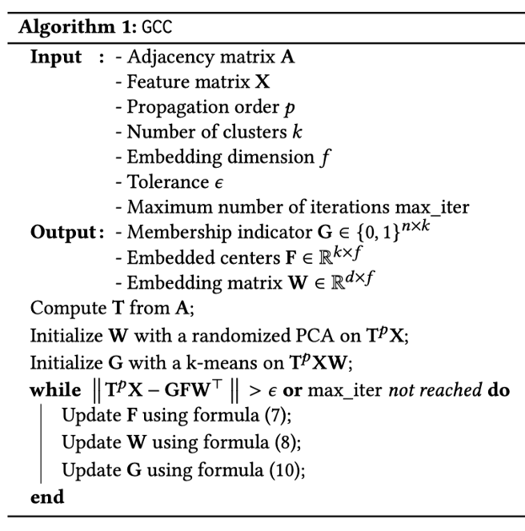

# Unsupervised GCN Tutorial

## Outline

1. Installation

2. Run experiments

3. Data preparation

4. Citation

### 1. Installation

Packages used in this tutorial might conflict with your currient enviornment, consider installing Anaconda. After installing Anaconda, you can create a new environment, for example, git_gnn (you can change to any name you like).

Two tutorials for anaconda installation: 

[*Anaconda Distribution*](https://docs.anaconda.com/anaconda/)

[*How to Successfully Install Anaconda on a Mac*](https://towardsdatascience.com/how-to-successfully-install-anaconda-on-a-mac-and-actually-get-it-to-work-53ce18025f97)

```python
#update anaconda if necessary
#conda update -n base -c defaults conda

#create an environment called git_gnn
conda create -n git_gnn
#activate your environment 
conda activate git_gnn
```

Example Environment:

- System: Anaconda
- Python: 3.10.8
- Python packages: pandas = 1.5.3, numpy = 1.23.5, tensorflow = 2.11.0, sklearn = 1.2.1, setuptools = 67.1.0, scanpy = 1.1.9

```python
conda install -c conda-forge tensorflow
conda install -c anaconda pandas
conda install -c anaconda scikit-learn
conda install -c conda-forge setuptools
conda install -c bioconda scanpy
```

*Note: If `import errors` occur during the execution of the scripts in this tutorial, please use `conda install` to install the required packages within the environment instead of using `pip`.

### 2. Run Experiments

 To verify the functionality of the current environment setup, run the model on public dataset `citeseer`

#### Example 

#### Parameter list

For `run.py`

| Parameter    | Type    | Default | Description                                     |
| ------------ | ------- | ------- | ----------------------------------------------- |
| `dataset`    | string  | `cora`  | Name of the graph dataset (`citeseer`, `FFD1`). |
| `power`      | integer | `5`     | First power to test.                            |
| `runs`       | integer | `20`    | Number of runs per power.                       |
| `n_clusters` | integer | `0`     | Number of clusters (`0` for ground truth).      |
| `max_iter`   | integer | `30`    | Number of iterations of the algorithm.          |
| `tol`        | float   | `10e-7` | Tolerance threshold of convergence.             |

To adaptively tune the power on Citeseer use


```bash
python gcc/tune_power.py --dataset=citeseer
```

To run the model on Citeseer for power `p=5` and have the average execution time



```bash
python gcc/run.py --dataset=citeseer --power 5
```

*Note: sometimes running these two command line in jupyter notebook will give you `ModuleNotFoundError: No module named 'gcc'` error, it is a better idea to run them in terminal.

If there still gives error messge, try the following:

```export PYTHONPATH="${PYTHONPATH}:/Users/ninasong/Desktop/spatialProject/literature_model/graph_convolutional_clustering/unsupervised-GCN"``` (change the path to your working directory)

For more details of this model, please find the WSDM '22 paper [*Efficient Graph Convolution for Joint Node Representation Learning and Clustering*](https://dl.acm.org/doi/10.1145/3488560.3498533).[*github*](https://github.com/chakib401/graph_convolutional_clustering)

### 3. Data prepration


Its the time to generate our own data and use it as the input for this unsupervised DCN model :>

For the step-by-step tutorial with explanation, please refer to: [*Jupyter Notebook of the tutorial*](https://github.com/USCDTG/unsupervised-GCN/blob/main/tutorial/Adj_feature_preparation.ipynb)

*Note: Files needed to generate `FFD1.mat` are located in `FFD1` folder, make sure when running the notbook, the path to required files are correct.

Once get the file `FFD1.mat` using the tutorial (make sure it is stored in `data` subdirectory), run the following command line in the terminal:

```python gcc/tune_power.py --dataset=FFD1 --max_power=30```

```python gcc/tune_power.py --dataset FFD1 --max_power 10```

Output file will be `pred_label_only.csv` in `/annotation` folder. The post processing section will combine the predict label with barcode, form the similar format of `tissue_position.csv`, thereby enabling its future utilization in visualizations via R studio. For downstream visulation, please refer to: 

### 4. Citation

```BibTeX
@inproceedings{fettal2022efficient,
  author = {Fettal, Chakib and Labiod, Lazhar and Nadif, Mohamed},
  title = {Efficient Graph Convolution for Joint Node Representation Learning and Clustering},
  year = {2022},
  publisher = {Association for Computing Machinery},
  doi = {10.1145/3488560.3498533},
  booktitle = {Proceedings of the Fifteenth ACM International Conference on Web Search and Data Mining},
  pages = {289–297},
}
```

